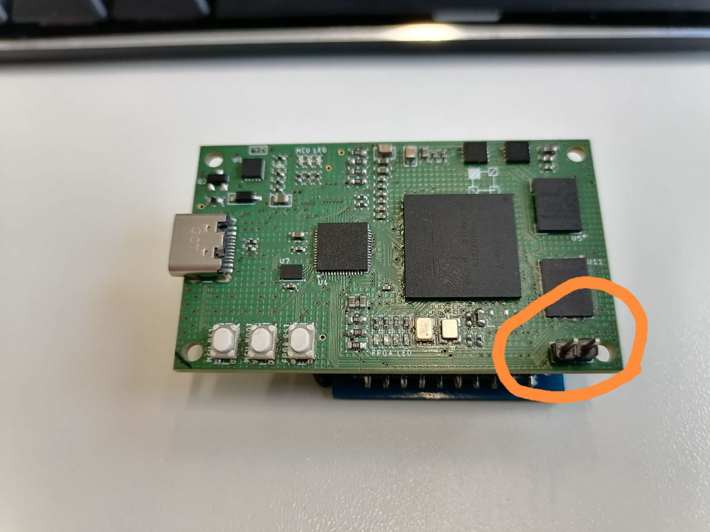

# FPGA Configuration

### Via Elastic-ai.runtime

Coming soon...

<!-- TODO: add fpga config flashing via monitor -->

### Via Python Script (**BROKEN**)

The FPGA on the ENv5 can be configured by writing a Bit- or Binfile to the flash.
To write a file to the flash, the enV5 needs to be flashed with the hardware test `hardware-test_configUSB.uf2` in
[out/Release/test/hardware/TestConfiguration](../../../build/debug/test/hardware/TestConfiguration).
**The Test only works on the enV5, not the SensorBoard.**
Put the Bit- or Binfile you want to send to the Device in the
directory [bitfile_scripts/bitfiles](../../../bitfile_scripts/bitfiles) and execute the python
script [BitfileFlasher.py](../../../bitfile_scripts/BitfileFlasher.py) with the required arguments:

```
python BitfileFlasher.py --port <device_serial_port> [--baudrate <serial_baudrate>] <path_to_bitfile> <start_flash_address>
```

- `--port` [required] serial port of the device
- `--baudrate` [optional] baudrate of serial connection
- `$1` [required] path to bitfile
- `$2` [required] start address of the flash, where the bitfile should be written to

The python script will send the Bitfile via serial to the enV5 and verifies that it has been written correctly.
To configure the FPGA with the new Bitfile, the FPGA has to be resetted (currently the FPGA will always reconfigure with
the config that starts at address 0x00).
The hardware test `hardware-test_fpga_config` can be used for this by sending the character `r` via serial to the
device.

### Known Problems

If the script fails repeatedly, it's possible that the Bitfile currently in the flash memory is defect and the FPGA
repeatedly tries to reconfigure without success.
The FPGA then blocks the flash until it is put into JTAG mode by shorting the 1x2 pin-header on the board, seen in the
picture below.


